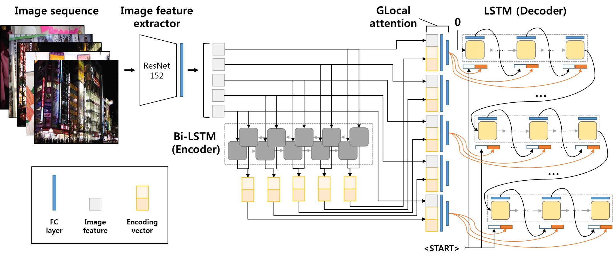

# GLAC Net: GLocal Attention Cascading Network

This repository is the implementation of [GLAC Net: GLocal Attention Cascading Network](https://arxiv.org/abs/1805.10973) for the [Visual Storytelling Challenge 2018](http://www.visionandlanguage.net/workshop2018) as a team SnuBiVtt. [Our model got the highest score in the human evaluation of the challenge.](http://aclweb.org/anthology/W18-1500)



<br>


### Dependencies
Python 3.6 or 2.7<br>
[Pytorch](https://pytorch.org) >= 1.0.0

<br>

### Prerequisites

##### 1. Clone the repository
```
git clone https://github.com/tkim-snu/GLACNet.git
cd GLACNet
```

##### 2. Download requirements
```
pip3 install -r requirements.txt
```

##### 3. Download sentence tokenizer
```{.python}
python3
>>> import nltk
>>> nltk.download('punkt')
>>> exit()
```

<br>

### Preprocessing

##### 1. Download the dataset
[VIST homepage](http://visionandlanguage.net/VIST/dataset.html)

##### 2. Resize images and build vocabulary
All the images should be resized to 256x256.
```
python3 resize.py --image_dir [train_image_dir] --output_dir [output_train_dir]
python3 resize.py --image_dir [val_image_dir] --output_dir [output_val_dir]
python3 resize.py --image_dir [test_image_dir] --output_dir [output_test_dir]
python3 build_vocab.py
```

<br>

### Training & Validation

```
python3 train.py
```

<br>

### Evaluation

##### 1. Download the [evaluation tool (METEOR score)](https://github.com/windx0303/VIST-Challenge-NAACL-2018) for the VIST Challenge
```
git clone https://github.com/windx0303/VIST-Challenge-NAACL-2018 ../VIST-Challenge-NAACL-2018
```

##### 2. Install Java
```
sudo apt install default-jdk
```

##### 3. Run eval.py script
```
python3 eval.py --model_num [my_model_num]
```
The result.json file will be found in the root directory.

<br>


### Pretrained model

We provide the pretrained model(for Python3).
Please download the [link](https://drive.google.com/drive/folders/10vBPeETCKZfdOr2zenB_WlmKDcRBHmYR?usp=sharing) and move to `<GLACNet root>/models/`.

<br>

### Citation

```
@article{Kim2018GLAC,
title={GLAC Net: GLocal Attention Cascading Networks for Multi-image Cued Story Generation},
author={Taehyeong Kim and Min-Oh Heo and Seonil Son and Kyoung-Wha Park and Byoung-Tak Zhang},
journal={CoRR},
year={2018},
volume={abs/1805.10973}
}
```

<br>

### License

MIT License<br>
This repository refer to [pytorch tutorial](https://github.com/yunjey/pytorch-tutorial) by [yunjey](https://github.com/yunjey).

